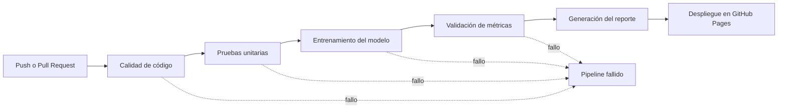

# MLOps CI/CD Model Monitoring

Pipeline MLOps orientado a producción para entrenar, validar y monitorizar modelos de machine learning mediante un flujo CI/CD automatizado.

El proyecto implementa un sistema de validación que bloquea modelos inválidos antes de su despliegue y publica un reporte HTML con los últimos resultados aprobados en GitHub Pages.


## Reporte en vivo

[Ver reporte en GitHub Pages](https://atinaredev.github.io/mlops-ci-cd-model-monitoring/)

## Descripción general

Este repositorio contiene un pipeline automatizado para validar modelos de machine learning antes de considerarlos aptos para producción.

El flujo incluye controles de calidad de código, pruebas automáticas, entrenamiento del modelo, validación de métricas y generación de un reporte visual publicado automáticamente.

El objetivo principal es asegurar que solo los modelos que cumplen criterios mínimos de calidad puedan ser aceptados.

## Características principales

- Pipeline CI/CD automatizado con GitHub Actions
- Validación de calidad de código con `ruff`
- Validación de formato con `ruff format`
- Chequeo estático de tipos con `ty`
- Pruebas unitarias con `pytest`
- Entrenamiento automático del modelo
- Validación automática de métricas
- Control de aceptación basado en accuracy, precision y recall
- Generación de reporte HTML
- Despliegue automático en GitHub Pages
- Seguimiento histórico de ejecuciones exitosas
- Proyecto preparado para portfolio técnico

## Criterios de aceptación del modelo

Un modelo se considera válido solo si todas las etapas del pipeline se ejecutan correctamente.

| Etapa | Requisito |
|---|---|
| Linting | `ruff check` debe pasar sin errores |
| Formato | `ruff format --check` debe pasar correctamente |
| Tipos | `ty check` debe pasar sin errores |
| Tests | `pytest` debe ejecutar las pruebas correctamente |
| Entrenamiento | Debe generarse una nueva versión del modelo |
| Validación | Accuracy, precision y recall deben ser al menos 80% |
| Reporte | Debe generarse y publicarse el reporte HTML |

Si cualquier etapa falla, el pipeline se detiene y el modelo queda rechazado.

## Flujo del pipeline



## Puerta de validación de métricas

Para que un modelo sea aceptado, debe cumplir los siguientes umbrales mínimos:

| Métrica | Mínimo requerido |
|---|---:|
| Accuracy | 80% |
| Precision | 80% |
| Recall | 80% |

Ejemplo del archivo de métricas esperado:

```json
{
  "accuracy": 0.84,
  "precision": 0.82,
  "recall": 0.81
}
```

## Estructura del repositorio

```text
.
├── .github/
│   └── workflows/
│       └── mlops.yml
├── scripts/
│   ├── validate_metrics.py
│   └── build_report.py
├── history/
│   └── metrics_history.json
├── public/
│   └── index.html
├── tests/
├── README.md
└── pyproject.toml
```

## Ejecución local

### 1. Clonar el repositorio

```bash
git clone https://github.com/AtinareDev/mlops-ci-cd-model-monitoring.git
cd mlops-ci-cd-model-monitoring
```

### 2. Crear entorno virtual

```bash
python -m venv .venv
```

Activar el entorno en Windows:

```bash
.venv\Scripts\activate
```

Activar el entorno en macOS/Linux:

```bash
source .venv/bin/activate
```

### 3. Instalar dependencias

```bash
python -m pip install --upgrade pip
python -m pip install -r requirements.txt
python -m pip install ruff ty pytest
```

### 4. Ejecutar controles de calidad

```bash
ruff check .
ruff format --check .
ty check .
```

### 5. Ejecutar pruebas

```bash
pytest -q
```

### 6. Entrenar el modelo

```bash
python -m src.train
```

### 7. Validar métricas

```bash
python scripts/validate_metrics.py \
  --metrics artifacts/metrics.json \
  --threshold 0.80
```

### 8. Generar reporte HTML

```bash
python scripts/build_report.py \
  --metrics artifacts/metrics.json \
  --model-info artifacts/model_info.json \
  --output-dir public
```

## CI/CD con GitHub Actions

El workflow se ejecuta automáticamente en cada push o pull request hacia la rama `main`.

Etapas del workflow:

1. Validación de calidad de código
2. Validación de formato
3. Chequeo estático de tipos
4. Ejecución de pruebas unitarias
5. Entrenamiento del modelo
6. Validación de métricas mínimas
7. Generación de reporte HTML
8. Despliegue automático en GitHub Pages

Solo las ejecuciones exitosas generan un reporte publicado.

## GitHub Pages

El reporte de resultados se publica automáticamente en:

```text
https://atinaredev.github.io/mlops-ci-cd-model-monitoring/
```

La página muestra información de la última ejecución aprobada, incluyendo métricas del modelo, estado de validación y detalles del pipeline.

## Tecnologías utilizadas

- Python
- GitHub Actions
- GitHub Pages
- Pytest
- Ruff
- Ty
- HTML
- JSON
- MLOps
- CI/CD

## Objetivo del proyecto

Este proyecto demuestra cómo aplicar buenas prácticas de MLOps en un flujo de machine learning automatizado.

El pipeline permite validar modelos de forma reproducible, controlar la calidad del código, automatizar pruebas y publicar resultados de manera clara para facilitar el seguimiento de versiones y rendimiento.

## Resultado esperado

Al finalizar una ejecución correcta del pipeline:

- El código habrá pasado controles de calidad.
- Las pruebas unitarias se habrán ejecutado correctamente.
- El modelo habrá sido entrenado.
- Las métricas habrán superado el umbral mínimo del 80%.
- Se habrá generado un reporte HTML.
- El reporte estará disponible públicamente en GitHub Pages.

## Autor

Desarrollado por [AtinareDev](https://github.com/AtinareDev).
