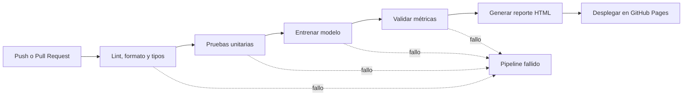

# MLOps Model Validation Pipeline

Pipeline MLOps orientado a producción para validar, entrenar y reportar ejecuciones de modelos de machine learning de forma automática.

El proyecto implementa un flujo CI/CD que bloquea modelos inválidos antes de su despliegue y publica un reporte HTML con los últimos resultados aprobados de validación.


## Reporte en vivo

[Ver reporte en GitHub Pages](https://<tu-usuario>.github.io/mlops-model-validation-pipeline/)

## Descripción general

Este proyecto proporciona un pipeline automatizado de entrega de modelos de machine learning enfocado en calidad, reproducibilidad y preparación para producción.

Cada candidato de modelo se valida mediante controles automáticos antes de ser aceptado como apto para producción.

## Características

- Pipeline CI/CD automatizado con GitHub Actions
- Validación de calidad de código con `ruff`
- Validación de formato con `ruff format`
- Chequeo estático de tipos con `ty`
- Pruebas unitarias con `pytest`
- Entrenamiento automático del modelo
- Puerta de validación de métricas
- Validación mínima para accuracy, precision y recall
- Generación de reporte HTML
- Despliegue automático en GitHub Pages
- Histórico de ejecuciones exitosas

## Criterios de aceptación del modelo

Un modelo se acepta solo si todos los pasos se ejecutan correctamente:

| Paso | Requisito |
|---|---|
| Linting | `ruff check` debe pasar |
| Formato | `ruff format --check` debe pasar |
| Tipos | `ty check` debe pasar |
| Tests | `pytest` debe pasar |
| Entrenamiento | Debe entrenarse una nueva versión del modelo |
| Validación | Accuracy, precision y recall deben ser al menos 80% |
| Reporte | El último resultado exitoso debe publicarse en GitHub Pages |

Si cualquier paso falla, el pipeline se detiene y el modelo se rechaza.

## Flujo del pipeline



## Puerta de métricas

El modelo debe cumplir los siguientes umbrales mínimos:

| Métrica | Mínimo requerido |
|---|---:|
| Accuracy | 80% |
| Precision | 80% |
| Recall | 80% |

Ejemplo de archivo de métricas esperado:

```json
{
  "accuracy": 0.84,
  "precision": 0.82,
  "recall": 0.81
}
```

## Estructura del repositorio

```text
.
├── .github/
│   └── workflows/
│       └── mlops.yml
├── scripts/
│   ├── validate_metrics.py
│   └── build_report.py
├── history/
│   └── metrics_history.json
├── public/
│   └── index.html
├── tests/
├── README.md
└── pyproject.toml
```

## Ejecución local

Instalar dependencias:

```bash
python -m pip install --upgrade pip
python -m pip install -r requirements.txt
python -m pip install ruff ty pytest
```

Ejecutar controles de calidad:

```bash
ruff check .
ruff format --check .
ty check .
```

Ejecutar tests:

```bash
pytest -q
```

Validar métricas del modelo:

```bash
python scripts/validate_metrics.py \
  --metrics artifacts/metrics.json \
  --threshold 0.80
```

Generar reporte HTML:

```bash
python scripts/build_report.py \
  --metrics artifacts/metrics.json \
  --model-info artifacts/model_info.json \
  --output-dir public
```

## CI/CD

El workflow se ejecuta automáticamente en cada push y pull request hacia la rama `main`.

Etapas del pipeline:

1. Controles de calidad
2. Pruebas unitarias
3. Entrenamiento del modelo
4. Validación de métricas
5. Generación del reporte HTML
6. Despliegue en GitHub Pages

Solo se publican las ejecuciones exitosas.

## Tecnologías utilizadas

- Python
- GitHub Actions
- GitHub Pages
- Pytest
- Ruff
- Ty
- HTML
- JSON

## Resultado

Este proyecto demuestra un flujo MLOps de estilo producción, donde los modelos de machine learning se prueban, validan y promocionan automáticamente solo cuando cumplen criterios estrictos de calidad.
